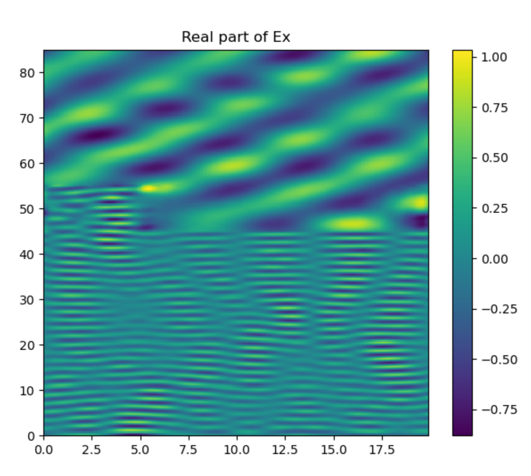
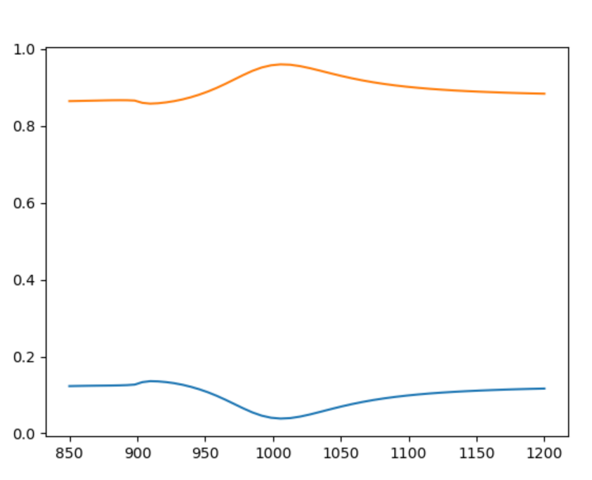

## About rcwa-cpp
This repo contains a 2d rcwa solver written in cpp.


## Compiling
```console
mkdir build
cd build
cmake ..
make
```

Libraries (fftw3, Eigen3, fmt) are automatically fetched (download and compiled in the build directory) if not found on your computer.

## Apps

#### rcwa-1d

Rcwa computation on 3 layered structures: Air, 0.25% of Air and 0.75 of Si, Si. 
You must create a directory named __output__ before running the executable file, ie:
```console
mkdir output
./build/apps/rcwa-1d
```

To visualize the output, use:
```python
python3 py/plot-field.py output/h-field.txt 1
```
to get the real part of $E_x$: 




#### rcwa-benchmark

Rcwa computation on several wavelengths, on 3 layered structures: SiO2, 0.20% of SiO2 and 0.75 of Si, Si. 
You must create a directory named __output__ before running the executable file, ie:
```console
mkdir output
./build/apps/rcwa-benchmark
```
To visualize the output, use:
```python
python3 py/plot-lines.py output/benchmark-result.txt
```
to the corresponding reflection and transmission computed.



#### test-interp

Just to test our LinearInterpolation class defined in include/LinearInterpolation.h .


#### epsilon-fourier

2D FFT (on going work). Achieving the 2D Fourier transform is a preliminary step to a 3D RCWA solver.
No need to launch the epsilon-fourier executable.


